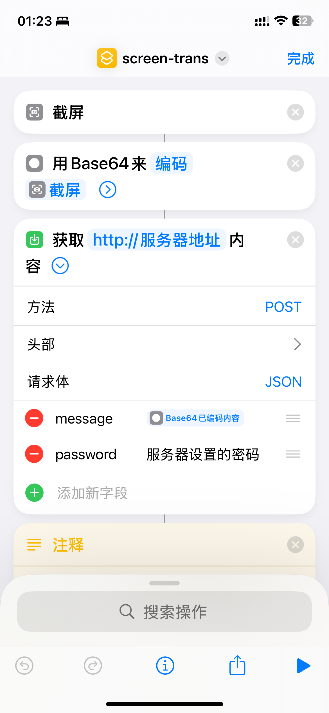

# Screen Translation Shortcut

基于IOS的快捷指令和火山引擎的图片翻译API，实现的移动端屏幕翻译功能。

## 效果演示
在任何APP的任何页面，只要轻击两下手机背面，就可以将屏幕内容翻译。如下演示内容所示：


## 服务端部署

### 方式一：本地开发调试

#### 1. 环境要求
- Node.js >= 14

#### 2. 安装依赖
```bash
# 安装项目依赖
npm install
```

#### 3. 配置环境变量
```bash
# 复制环境变量示例文件
cp .env.example .env

# 编辑 .env 文件，填入必要的配置
```

环境变量说明：
- `TARGET_LANGUAGE`: 目标翻译语言见[火山引擎图片翻译API](https://www.volcengine.com/docs/4640/65105)
- `API_PASSWORD`: 设置API访问密码
- `VOLC_ACCESS_KEY`: 火山引擎访问密钥ID
- `VOLC_SECRET_KEY`: 火山引擎访问密钥密码

> 注意：获取访问密钥流程见[火山引擎API接入流程文档](https://www.volcengine.com/docs/4640/130872)

#### 4. 启动服务
```bash
node ImagesTrans.js
```

### 方式二：Docker 部署

#### 1. 环境要求
- Docker
- Docker Compose（可选，用于更方便的部署）

#### 2. 使用 Docker Compose

```bash
# 复制环境变量示例文件
cp .env.example .env

# 编辑 .env 文件，填入必要的配置

# 启动服务
docker-compose up -d

# 查看日志
docker-compose logs -f

# 停止服务
docker-compose down
```

#### 3. 使用 Docker 直接部署（推荐）

```bash
# 运行容器(dockerhub镜像)
docker run -d \
  --name screen-trans \
  -p 3000:3000 \
  -e TARGET_LANGUAGE=zh \
  -e API_PASSWORD=your_password \
  -e VOLC_ACCESS_KEY=your_access_key \
  -e VOLC_SECRET_KEY=your_secret_key \
   mmclouds/screen-trans-shortcut


# 运行容器(阿里云镜像，适合国内使用)
docker run -d \
  --name screen-trans \
  -p 3000:3000 \
  -e TARGET_LANGUAGE=zh \
  -e API_PASSWORD=your_password \
  -e VOLC_ACCESS_KEY=your_access_key \
  -e VOLC_SECRET_KEY=your_secret_key \
   registry.cn-hangzhou.aliyuncs.com/mmclouds/screen-trans-shortcut
```

## 快捷指令的配置
### 1. 添加快捷指令
手机上访问该链接：https://www.icloud.com/shortcuts/0008eb28503e42c2a187aef8bc94627d
，添加快捷指令如下：




### 2. 修改配置
打开快捷指令，设置自己服务器的地址和密码即可。
### 3. 双击触发快捷指令配置
按照如下配置即可


### 4. 注意事项
- 以上测试均基于IOS18.1.1版本。**老版本的一些快捷指令脚本不支持，需要更新到最新版本**。
- 目前版本的快捷指令仍不稳定，会有偶发性地图片渲染失败。目前没想到好的解决办法，有高手可以指点一下感激不尽。

## 许可证

MIT License