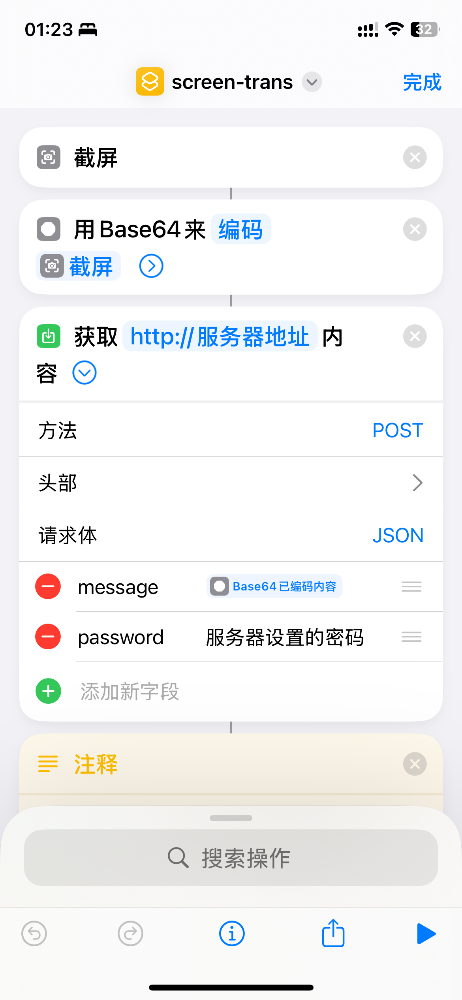
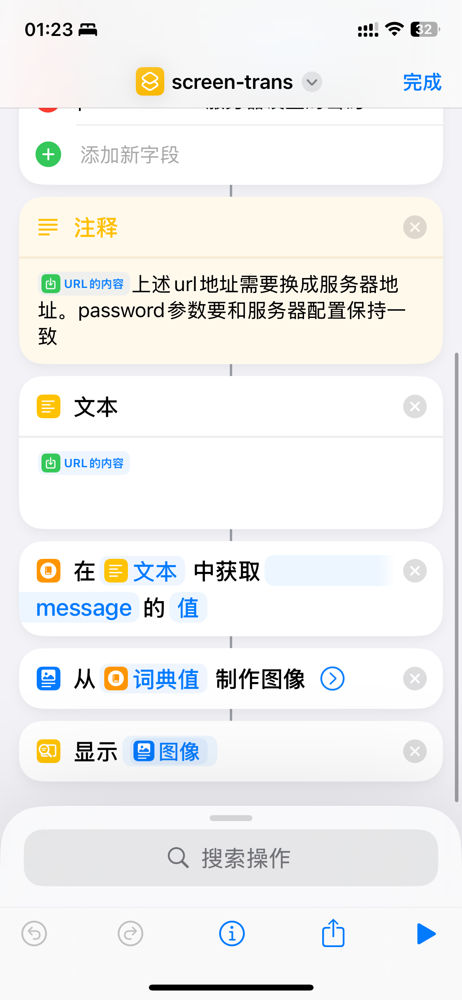

# Screen Translation Shortcut

一个基于火山引擎图片翻译 API 的屏幕翻译工具后端服务。可以快速翻译截图中的文字内容，支持多语言翻译。

## 效果演示


## 功能特点

- 支持多种语言翻译（中文、英文、日语、韩语等）
- 自动图片压缩和优化，提高翻译速度和质量
- 简单的 API 接口，易于集成
- 支持 Docker 部署
- 安全的密码验证机制

## 服务端部署

### 方式一：本地开发调试

#### 1. 环境要求
- Node.js >= 14
- npm 或 yarn

#### 2. 安装依赖
```bash
# 安装项目依赖
npm install
```

#### 3. 配置环境变量
```bash
# 复制环境变量示例文件
cp .env.example .env

# 编辑 .env 文件，填入必要的配置
```

环境变量说明：
- `TARGET_LANGUAGE`: 目标翻译语言（如：zh, en, ja, ko）
- `API_PASSWORD`: 设置API访问密码
- `VOLC_ACCESS_KEY`: 火山引擎访问密钥ID
- `VOLC_SECRET_KEY`: 火山引擎访问密钥密码

> 注意：请在火山引擎控制台获取访问密钥：https://console.volcengine.com/iam/keymanage/

#### 4. 启动服务
```bash
node ImagesTrans.js
```

### 方式二：Docker 部署

#### 1. 环境要求
- Docker
- Docker Compose（可选，用于更方便的部署）

#### 2. 使用 Docker Compose（推荐）

```bash
# 复制环境变量示例文件
cp .env.example .env

# 编辑 .env 文件，填入必要的配置

# 启动服务
docker-compose up -d

# 查看日志
docker-compose logs -f

# 停止服务
docker-compose down
```

#### 3. 使用 Docker 直接部署

```bash

# 运行容器(dockerhub镜像)
docker run -d \
  --name screen-trans \
  -p 3000:3000 \
  -e TARGET_LANGUAGE=zh \
  -e API_PASSWORD=your_password \
  -e VOLC_ACCESS_KEY=your_access_key \
  -e VOLC_SECRET_KEY=your_secret_key \
   mmclouds/screen-trans-shortcut


# 运行容器(阿里云镜像，适合国内使用)
docker run -d \
  --name screen-trans \
  -p 3000:3000 \
  -e TARGET_LANGUAGE=zh \
  -e API_PASSWORD=your_password \
  -e VOLC_ACCESS_KEY=your_access_key \
  -e VOLC_SECRET_KEY=your_secret_key \
   registry.cn-hangzhou.aliyuncs.com/mmclouds/screen-trans-shortcut

```

### 快捷指令的配置
#### 1. 第一步，添加快捷指令
手机上访问该链接：https://www.icloud.com/shortcuts/2dd55a9bf91b4c1a977284425c2fffee，添加快捷指令如下：



#### 2. 第二步，修改配置
打开快捷指令，设置自己服务器的地址和密码即可。
#### 3. 第三步，双击触发快捷指令
按照如下配置即可


## 许可证

MIT License