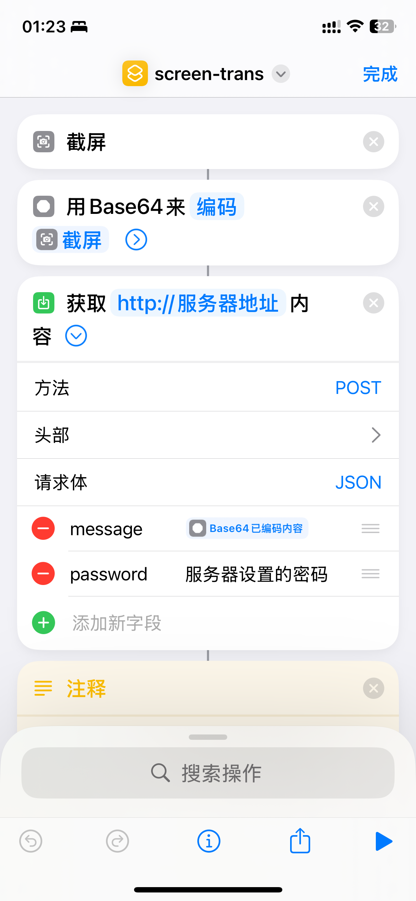
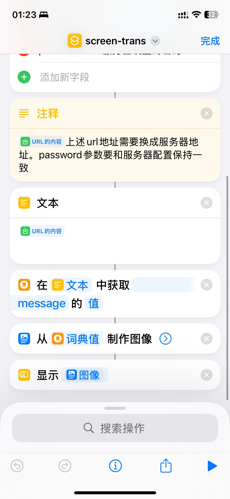

# Screen Translation Shortcut

基于 iOS 快捷指令和火山引擎图片翻译 API 实现的移动端屏幕翻译工具。

支持翻译历史回顾、AI 自动提取生词和语法点，方便持续提升翻译能力。

## 效果演示

在任何 App 页面，轻击两下手机背面即可翻译屏幕内容：


---

## 项目结构

```
screen-trans-shortcut/
├── worker/                   # Cloudflare Worker（翻译 API + Queue AI 提取 + 回顾页面）
│   ├── package.json
│   ├── wrangler.toml         # 本地创建，包含资源绑定，不提交
│   ├── wrangler.toml.example
│   ├── .dev.vars             # 本地创建，存放本地调试密钥，不提交
│   ├── .dev.vars.example
│   ├── tsconfig.json
│   ├── schema.sql
│   ├── src/
│   │   ├── types.ts
│   │   ├── db.ts             # D1 数据库 CRUD
│   │   └── index.ts          # API 路由
│   └── public/               # 回顾页面（前端）
│       ├── index.html
│       ├── app.js
│       └── style.css
│
└── docs/
    └── DESIGN.md             # 详细设计文档
```

当前推荐直接部署 `worker/`：翻译、图片压缩、R2 持久化、D1 写入和 AI 队列提取都在 Worker 侧完成。

---

## Worker 本地调试

当前项目只需要调试 `worker/` 目录。`server/` 是旧版 Express 实现，不再作为推荐运行路径。

### 本地 D1 和远程 D1 是什么关系

Wrangler 本地调试时默认使用本地模拟资源：

- `npx wrangler dev`：连接本地 D1、本地 R2、本地 Queue，数据保存在 `worker/.wrangler/` 下。
- `npx wrangler d1 execute screen-trans-db --file=schema.sql --local`：给本地 D1 建表。
- `npx wrangler d1 execute screen-trans-db --file=schema.sql --remote`：给 Cloudflare 线上 D1 建表或迁移。

所以一般不需要在 Cloudflare 上为了“本地调试”再创建第二个 D1。你只需要：

1. 线上有一份真实 D1，用于生产 Worker。
2. 本地由 Wrangler 自动维护一份本地 D1，用于 `wrangler dev`。

如果你想做“云端测试环境”，才需要额外创建一份 Cloudflare D1，例如 `screen-trans-db-staging`，并用 Wrangler environment 单独绑定它。普通本地调试不用这么做。

注意：普通 `wrangler dev` 下 R2 也是本地模拟的，但当前代码写入数据库的图片地址来自 `R2_PUBLIC_URL`。如果用本地 R2，记录能写入本地 D1，翻译接口也能返回译图 base64，但回顾页面里的图片 URL 可能无法通过公网 `r2.dev` 打开。要完整验证线上图片展示，可以部署后验证，或谨慎使用 `wrangler dev --remote` 连接远程资源。

### 本地变量放哪里

本地调试涉及两类配置：

| 文件 | 是否提交 | 适合放什么 |
|------|----------|------------|
| `worker/wrangler.toml` | 否 | Worker 名称、D1/R2/Queue 绑定、非敏感变量 |
| `worker/.dev.vars` | 否 | 本地调试密钥，如 `API_PASSWORD`、`VOLC_ACCESS_KEY`、`VOLC_SECRET_KEY`、`OPENROUTER_API_KEY` |
| Cloudflare Secrets | 线上保存 | 生产密钥，通过 `wrangler secret put` 设置 |

`wrangler.toml` 与 `.dev.vars` 都放在 `worker/` 目录，也就是 Wrangler 配置文件同级目录。

本地示例：

```bash
cd worker
cp wrangler.toml.example wrangler.toml
cp .dev.vars.example .dev.vars
```

然后编辑 `worker/wrangler.toml`：

```toml
name = "screen-trans-api"
main = "src/index.ts"
compatibility_date = "2025-05-31"

[[d1_databases]]
binding = "DB"
database_name = "screen-trans-db"
database_id = "线上 D1 的 database_id"

[[r2_buckets]]
binding = "IMAGE_BUCKET"
bucket_name = "screen-trans-images"

[vars]
TARGET_LANGUAGE = "zh"
R2_PUBLIC_URL = "https://pub-xxx.r2.dev"
OPENROUTER_MODEL = "openai/gpt-4o-mini"
```

再编辑 `worker/.dev.vars`：

```dotenv
WORKER_API_KEY="dev-worker-api-key"
API_PASSWORD="dev-shortcut-password"
VOLC_ACCESS_KEY="your-volc-access-key"
VOLC_SECRET_KEY="your-volc-secret-key"
OPENROUTER_API_KEY="sk-or-v1-xxx"
```

### 首次本地启动

```bash
cd worker

# 1. 安装依赖
npm install

# 2. 初始化本地 D1 表结构
npx wrangler d1 execute screen-trans-db --file=schema.sql --local

# 3. 启动本地 Worker
npm run dev
```

启动后访问：

```text
http://localhost:8787
```

回顾页面、API、静态资源都会从本地 Worker 提供。

### 本地接口测试

```bash
curl -X POST http://localhost:8787/api/translate \
  -H "Content-Type: application/json" \
  -d "{\"message\":\"<base64图片>\",\"password\":\"dev-shortcut-password\"}"
```

也可以直接请求列表接口检查本地 D1：

```bash
curl http://localhost:8787/api/translations
```

查看本地 D1 内容：

```bash
npx wrangler d1 execute screen-trans-db --local --command "SELECT id, created_at FROM translations ORDER BY created_at DESC LIMIT 5"
```

### 本地执行图片压缩

图片压缩不是单独的命令，而是在翻译接口里自动执行：

```text
POST /api/translate
  -> compressImage(env.IMAGES, ...)
  -> translateImage(...)
  -> R2 写入
  -> D1 写入
  -> AI_QUEUE.send(...)
```

所以本地执行压缩的方式就是启动 Worker 后调用翻译接口：

```bash
cd worker
npm run dev
```

另一个终端请求：

```bash
curl -X POST http://localhost:8787/api/translate \
  -H "Content-Type: application/json" \
  -d "{\"message\":\"<base64图片>\",\"password\":\"dev-shortcut-password\"}"
```

默认 `wrangler dev` 会使用本地模拟的 Images binding。Cloudflare Images 的本地模拟能力有限，如果要验证更接近线上的压缩/转换效果，可以临时把 `worker/wrangler.toml` 改成：

```toml
[images]
binding = "IMAGES"
remote = true
```

然后继续用：

```bash
npm run dev
```

这样 Worker 代码仍在本地跑，但 Images binding 会连接 Cloudflare 远程能力。只想完全按线上环境跑时，也可以用 `npx wrangler dev --remote`，但它会连接远程绑定，可能写入线上 R2、D1、Queue。

### 本地执行队列

本地不需要创建真实 Queue。只要 `wrangler.toml` 里有 producer 和 consumer 配置，`npm run dev` 会启动本地模拟 Queue：

```toml
[[queues.producers]]
binding = "AI_QUEUE"
queue = "screen-trans-ai"

[[queues.consumers]]
queue = "screen-trans-ai"
max_batch_size = 5
max_batch_timeout = 30
max_retries = 3
retry_delay = 60
```

触发队列有两种方式：

1. 调用 `/api/translate`，翻译成功并且识别出 `source_text` 后，会自动执行 `AI_QUEUE.send(...)`。
2. 对已有翻译记录调用 AI 重试接口：

```bash
curl -X POST http://localhost:8787/api/translations/<translation_id>/ai/retry \
  -H "Authorization: Bearer dev-worker-api-key"
```

如果本地 `.dev.vars` 没有配置 `OPENROUTER_API_KEY`，队列会被跳过或重试接口返回配置错误。要完整跑通 Queue consumer，需要：

```dotenv
OPENROUTER_API_KEY="sk-or-v1-xxx"
```

Worker 终端里能看到类似日志：

```text
AI 队列已投递: <translation_id>
AI 队列消费批次: 1
AI 队列消息完成: <translation_id> ...
```

### 调试远程线上数据

谨慎使用远程命令，它们会直接读写线上资源。

查询线上 D1：

```bash
npx wrangler d1 execute screen-trans-db --remote --command "SELECT id, created_at FROM translations ORDER BY created_at DESC LIMIT 5"
```

本地启动但连接远程资源：

```bash
npx wrangler dev --remote
npx wrangler login --browser=false (不自动跳转浏览器)
```

这适合排查“线上绑定/Cloudflare 环境才出现”的问题，但翻译记录、R2 图片、Queue 消息可能会写入生产资源。日常开发建议使用普通 `npm run dev`。

---

## 线上部署

### 前置：Cloudflare 基础设施

部署前需要在 Cloudflare 创建以下资源：

**1. 创建 R2 存储桶**
- 进入 [Cloudflare Dashboard → R2](https://dash.cloudflare.com/)
- 创建 Bucket，名称如 `screen-trans-images`
- **开启 Public Access**（通过 `r2.dev` 域名公开访问）
- 记录 `R2_PUBLIC_URL`（格式 `https://pub-xxx.r2.dev`）

**2. 创建 D1 数据库**
```bash
cd worker
npx wrangler d1 create screen-trans-db
# 将输出的 database_id 和 database_name 复制备用
```

**3. 创建 AI 队列**
```bash
cd worker
npx wrangler queues create screen-trans-ai
```

**4. 执行建表语句**
```bash
cd worker
cp wrangler.toml.example wrangler.toml
# 编辑 wrangler.toml，填入 database_id、R2_PUBLIC_URL 等非敏感配置
npx wrangler d1 execute screen-trans-db --file=schema.sql --remote
```

---

### 部署上线

```bash
cd worker

# 1. 设置生产密钥
npx wrangler secret put WORKER_API_KEY
npx wrangler secret put API_PASSWORD
npx wrangler secret put VOLC_ACCESS_KEY
npx wrangler secret put VOLC_SECRET_KEY
npx wrangler secret put OPENROUTER_API_KEY

# 2. 执行数据库迁移（生产环境）
npx wrangler d1 execute screen-trans-db --file=schema.sql --remote

# 3. 部署（API + 前端一起上线）
npx wrangler deploy
# Worker 部署到 https://screen-trans-api.<your-subdomain>.workers.dev
# 直接访问即可看到回顾页面
```

### Worker 变量说明

| 变量 | 必填 | 说明 |
|------|------|------|
| `WORKER_API_KEY` | 是 | 后台写操作共享密钥。本地放 `.dev.vars`，线上用 secret |
| `API_PASSWORD` | 是 | iOS 快捷指令访问密码。本地放 `.dev.vars`，线上用 secret |
| `TARGET_LANGUAGE` | 是 | 目标翻译语言，如 `zh`/`en`/`ja`/`ko`。可放 `wrangler.toml` |
| `VOLC_ACCESS_KEY` | 是 | 火山引擎 Access Key。本地放 `.dev.vars`，线上用 secret |
| `VOLC_SECRET_KEY` | 是 | 火山引擎 Secret Key。本地放 `.dev.vars`，线上用 secret |
| `R2_PUBLIC_URL` | 是 | R2 公开访问地址 |
| `OPENROUTER_API_KEY` | 否 | OpenRouter API Key。本地放 `.dev.vars`，线上用 secret |
| `OPENROUTER_MODEL` | 否 | 模型名，默认 `openai/gpt-4o-mini` |

---

## 架构说明

```
iOS 快捷指令
    │  POST /  (base64 图片 + 密码)
    ▼
Cloudflare Worker
    │
    ├─ Images binding ──→ 压缩截图
    ├─ 火山引擎 API ──→ 翻译图片
    ├─ R2 ──→ 存储原文 + 译文图片
    ├─ D1 ──→ 写入翻译记录
    └─ Queue ──→ OpenRouter AI 提取词汇 + 语法，再写回 D1
```

- **翻译请求不等 AI**：图片翻译、R2 上传和 D1 记录写入完成后立即返回，AI 提取由 Queue 异步处理
- **Worker 同源托管**：API 和前端部署在同一个 Worker，无 CORS 问题
- **R2 公开访问**：图片存完整 URL，前端 `` 直接加载，无需预签名

## 回顾页面

部署 Worker 后，访问 Worker 地址即可看到翻译回顾页面：

- **列表页**：展示所有翻译历史，带缩略图和时间
- **详情页**：原文/译文图片左右对比，点击放大查看
- **词汇 Tab**：AI 自动提取的生词表，支持手动增删改
- **语法 Tab**：AI 自动提取的语法笔记，支持手动增删改

页面适配移动端，手机上可直接查看。

## 快捷指令配置

### 1. 添加快捷指令

手机访问：https://www.icloud.com/shortcuts/0008eb28503e42c2a187aef8bc94627d




### 2. 修改配置

打开快捷指令，设置服务器的地址和密码。

### 3. 双击触发


### 4. 注意事项

- 以上测试基于 iOS 18.1.1，**老版本快捷指令脚本不支持，需更新到最新版本**
- 快捷指令偶发性图片渲染失败，暂无完美解决方案

## 许可证

MIT License
